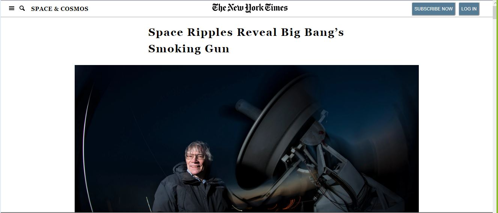

## New York Times

PROJECT: POSITIONING AND FLOATING ELEMENTS

Project Design Screenshot : 


## Built With
 
- HTML5
- CSS3

## Live Demo

[Live Demo Link](https://rawcdn.githack.com/Alaska01/Aye-John-New-York-Times/b2c5cc5a6ec1e2b0a9006d08ca131931380d81b5/index.html)

# Getting Started 🚀

These instructions will get you a copy of the project up and running on your local machine.

## How To Use 🔧

From your command line, first clone the project:

```bash
# Clone this repository
$ git clone https://github.com/Alaska01/Aye-John-New-York-Times.git

# Go into the repository
$ cd NYT

```

## CONTRIBUTOR

👤 **John MUGIRANEZA**

- [Github](https://www.github/mujohn36)
- [Twitter](https://www.twitter.com/mugiraneza1)
- [Linkedin](https://www.linkedin.com/in/john-mugiraneza/)

👤 **Aye Daniel A**

- [Github](https://github.com/Alaska01)
- [Twitter](https://twitter.com/AyeAsoo)
- [Linkedin](https://www.linkedin.com/in/daniel-asoo-aye-178500140/)

## Show your support

Give a ⭐️ if you like this project!

## Acknowledgments

- Thanks to Microverse and The Odin Project.

## 📝 License

This project is [MIT](lic.url) licensed.
